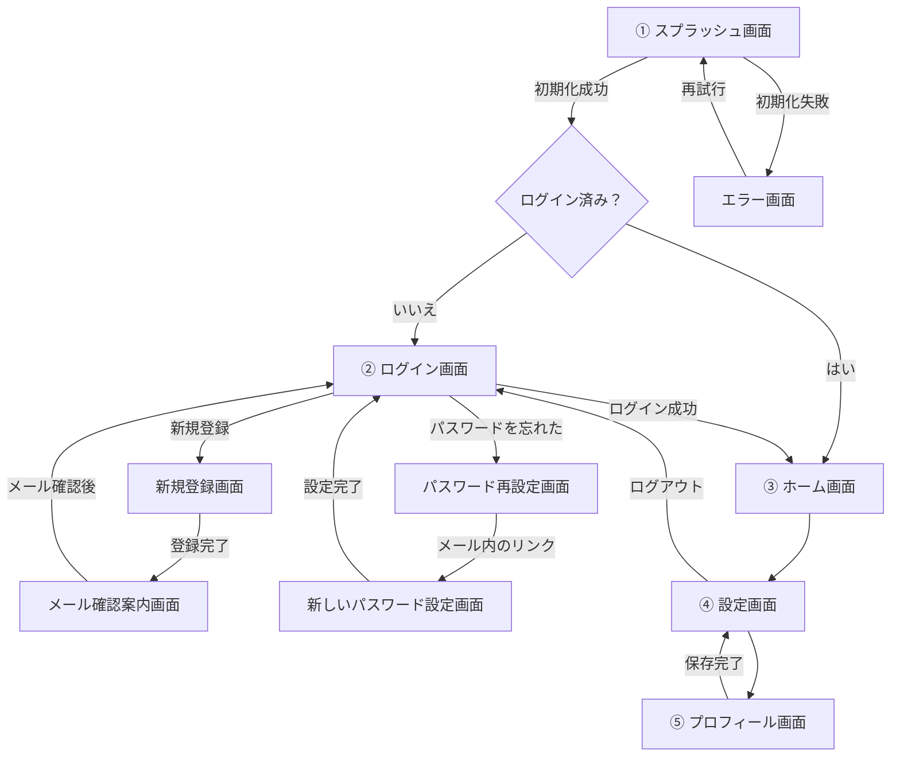
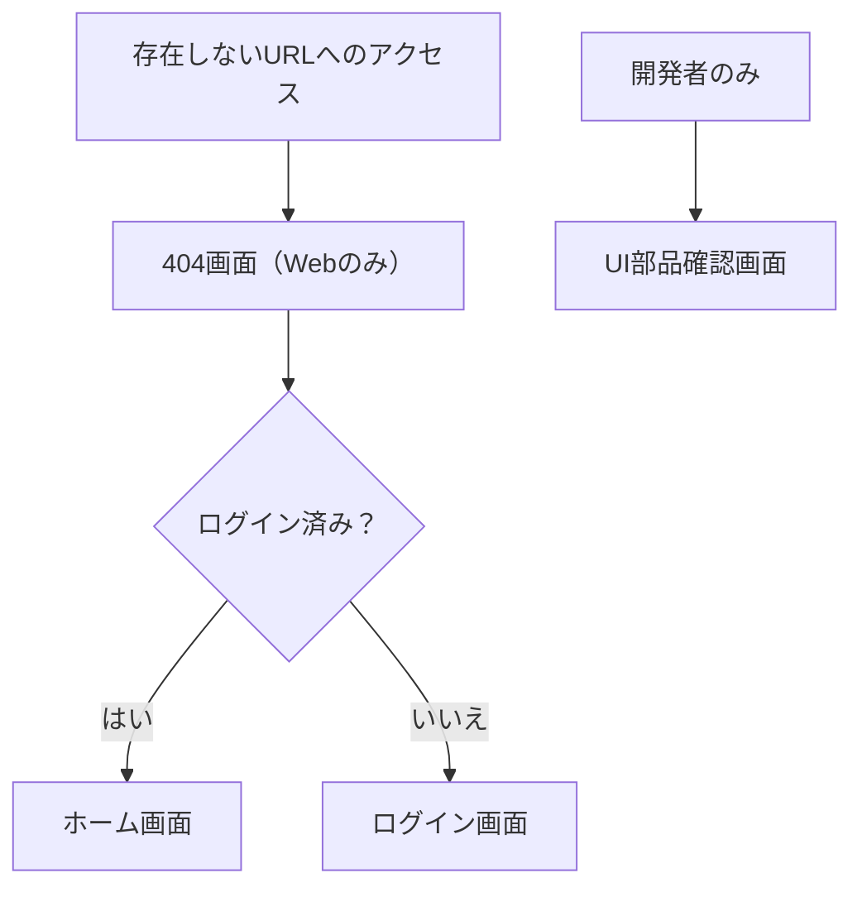

# 外部設計・UI

利用者から見える画面、操作、表示ルールを記録します。

## 画面一覧

| 区分     | 画面                     | 役割                                     |
| -------- | ------------------------ | ---------------------------------------- |
| 起動     | スプラッシュ画面         | アプリの初期化と認証状態の確認           |
| 認証前   | ログイン画面             | メールアドレスとパスワードによるログイン |
| 認証前   | 新規登録画面             | アカウントの新規登録                     |
| 認証前   | メール確認案内画面       | 確認メールの案内と再送                   |
| 認証前   | パスワード再設定画面     | パスワード再設定メールの送信             |
| 認証前   | 新しいパスワード設定画面 | メールリンクから新しいパスワードを設定   |
| 認証後   | ホーム画面               | ログイン後の起点とスターターの動作確認   |
| 認証後   | 設定画面                 | アプリとアカウントの設定                 |
| 認証後   | プロフィール画面         | 表示名の確認と編集                       |
| システム | エラー画面               | 継続できないエラーの表示                 |
| Web      | 404画面                  | 存在しないURLへアクセスした場合の案内    |
| 開発専用 | UI部品確認画面           | 共通UI部品と各状態の確認                 |

## 画面遷移

通常利用の流れは上から下へ記載し、通常フローに含まれない画面は補助画面として分離します。

### 通常フロー

### 補助画面

## レスポンシブ構造

### Android・Web 767px以下

- 上部に共通ヘッダー、中央にメインコンテンツ、下部にナビゲーションを配置する
- 下部ナビゲーションは「ホーム」「設定」のアイコンと文字を常時表示する
- 高さは64pxとし、端末下部の安全領域を加える
- 画面左右の余白は16px、コンテンツは利用可能な横幅いっぱいとする

### Web 768px以上

- 左側に幅240pxのサイドバーを固定する
- サイドバー上部にロゴとアプリ名、中央に「ホーム」「設定」、下部にバージョンを表示する
- 選択中の項目はメインカラーと背景色で強調し、未選択はグレーとする
- 右側に共通ヘッダーとメインコンテンツを配置し、メインコンテンツのみ縦スクロールする
- 本文は最大幅1200px、左右余白24pxとし、サイドバーを除いた領域内で中央配置する

## 共通ヘッダー

- 高さは56pxとし、スクロール中も上部に固定する
- 左側に画面タイトルを表示する
- 詳細画面では戻るボタンを表示する
- 右側には画面固有の操作がある場合のみボタンを表示する
- 下側に細い境界線を表示する
- サイドバーがない画面では、必要に応じてロゴまたはアプリ名を表示する

## 各画面の仕様

### スプラッシュ画面

- 中央にロゴとアプリ名を表示する
- 認証状態と初期データを確認する
- ログイン済みならホーム、未ログインならログイン、初期化失敗ならエラー画面へ遷移する
- 最低表示時間は設けず、準備ができ次第遷移する
- 初期化が長引く場合のみローディングを表示する

### ログイン画面

- ロゴ、アプリ名、メールアドレス、パスワード、パスワード表示切替を表示する
- ログイン、新規登録、パスワード再設定への操作を提供する
- 送信中は入力とボタンを無効化し、二重送信を防止する
- 成功後はホームへ遷移し、成功メッセージは表示しない
- 項目の入力エラーは各項目の直下、認証エラーは画面上部のSnackbarで表示する

### 新規登録画面

- メールアドレス、パスワード、パスワード確認を表示する
- パスワードは8文字以上64文字以下とし、確認入力との一致を必須とする
- 文字種の組み合わせは強制せず、空白だけのパスワードは許可しない
- 登録ボタンとログイン画面へ戻るリンクを表示する
- 利用規約とプライバシーポリシーへのリンク用領域を用意する
- 実際の規約がない段階では同意チェックボックスを表示しない
- 登録後はメール確認案内画面へ遷移する

### メール確認案内画面

- 確認メールを送信したメールアドレスを省略せず表示する
- メール内のリンクを開くよう案内する
- 確認メールの再送ボタンとログイン画面へ戻るリンクを表示する
- 再送中は二重送信を防止し、結果はSnackbarで表示する

### パスワード再設定画面

- メールアドレス、再設定メール送信ボタン、ログイン画面へ戻るリンクを表示する
- 送信成功後は画面上に案内を残し、結果をSnackbarでも通知する
- メール内のリンクから新しいパスワード設定画面を開く

### 新しいパスワード設定画面

- 新しいパスワードと確認入力、設定ボタンを表示する
- 設定完了後はログイン画面へ遷移する
- 無効または期限切れのリンクでは、再設定メールを再送する導線を表示する

### ホーム画面

スターターの動作確認用画面とし、コピー後に置き換える前提とします。

- 挨拶または画面説明、ログイン中のメールアドレスを表示する
- サンプルカード、通常ボタン、API・Repository接続確認用のサンプル領域を表示する
- ローディング、空状態、エラー状態を確認できる導線を用意する

### 設定画面

- アカウント：ログイン中のメールアドレス、プロフィールへの導線
- 表示：テーマ設定
- アプリ情報：アプリバージョン、利用規約、プライバシーポリシー
- 操作：ログアウト
- ログアウト時は確認ダイアログを表示する

### プロフィール画面

- 表示名、編集不可のメールアドレス、保存ボタンを表示する
- 表示名は必須とし、前後の空白を除いて1文字以上50文字以下とする
- 表示名の文字種は制限せず、日本語、英数字、記号、絵文字を入力できる
- 保存ボタンは表示名の変更を保存するために使用する
- 保存成功後は設定画面へ戻る
- 変更がなければ確認なしで戻り、変更後は破棄確認を表示する
- プロフィール画像は初期版に含めない

### エラー画面

- エラーを表すアイコン、「読み込みに失敗しました」、簡潔な説明、再試行ボタンを表示する
- 必要な場合のみホームへ戻るボタンを表示する
- 開発環境だけ詳細情報を表示し、本番環境では内部エラーを露出しない

### 404画面（Webのみ）

- 「ページが見つかりません」と戻るボタンを表示する
- ログイン済みならホーム、未ログインならログインへ戻す
- URL以外の技術情報は表示しない

### UI部品確認画面（開発時のみ）

- 色、文字、ボタン、入力、選択、チェックボックス、スイッチ、カードを一覧表示する
- Snackbar、ダイアログ、ローディング、空状態、エラー状態を確認できる
- ライト・ダーク、無効・フォーカス・エラーなどの状態を確認できる
- 本番ビルドでは到達できないようにする

## 入力フォーム

- ラベルは入力欄の上に常時表示し、プレースホルダーだけに意味を持たせない
- 必須項目には「必須」と表示する
- 入力欄を離れた時点から検証し、送信時に全項目を再検証する
- 入力エラーは該当項目の直下に、原因と修正方法が分かる表現で表示する
- 送信時は最初のエラー項目へフォーカスする
- 通信失敗でも入力内容を消さない
- WebではEnterキーによる送信を可能にする
- パスワードの貼り付けを許可する

## 共通フィードバック

### Snackbar

- 画面上部に表示する
- 成功は緑、エラーは赤、情報は青、警告は黄を基調とする
- 種類にかかわらず閉じるボタンを表示し、いつでも手動で閉じられる
- 通常は約4秒後に自動で閉じる
- 複数の通知は同時に積まず、順番に表示する
- 項目単位の入力エラーには使用しない

### 確認ダイアログ

- ログアウト、編集内容の破棄、データ削除など、取り消しにくい操作だけに使用する
- ボタン順は「キャンセル」「実行」とする
- 削除などの危険な操作は赤色で表示する

### ローディング

- ボタン処理中はボタン内にインジケーターを表示する
- 画面の初回読み込みはスケルトンを表示する
- 短い再読み込みでは既存内容を残し、小さな進捗表示を加える
- 二重送信を防止し、画面全体をむやみに空白にしない

### 空状態

- 状態の説明と次にできる操作を表示する
- 必要な場合は作成ボタンなどの主要操作を表示する

## デザイン基準

### 色

- メインカラーは青系、背景は明るいグレー、表面は白、本文は濃いグレーを初期値とする
- 補助文字は中間グレー、成功は緑、警告は黄、エラーは赤を使用する
- 色はテーマで交換できる構造にする
- 色だけで状態を区別せず、文字やアイコンを併用する

### 文字サイズ

| 用途               | サイズ |
| ------------------ | ------ |
| 画面タイトル       | 24px   |
| セクションタイトル | 20px   |
| 項目タイトル・本文 | 16px   |
| 補助文字           | 14px   |
| 小さな注記         | 12px   |
| ボタン             | 16px   |

### 余白・角丸・影

- 余白は4px単位とし、4・8・16・24・32・40pxを使用する
- 入力欄とボタンは8px、カードは12px、ダイアログは16pxの角丸とする
- 境界線を基本とし、影は薄く、必要な箇所だけに使用する

## テーマ

- 「端末設定に合わせる」「ライト」「ダーク」を選択できる
- 初期値は「端末設定に合わせる」とする
- 設定は端末内に保存し、ログアウト後も維持する

## アクセシビリティ

以下は利用者が個別に設定する項目ではなく、スターターの共通品質として実装します。

- タップ領域を最低44×44px確保する
- 文字と背景のコントラストを確保する
- アイコンボタンに読み上げ名を設定する
- Webではキーボードだけでも操作可能にし、フォーカス位置を見えるようにする
- エラー発生を読み上げで通知する
- 文字を拡大しても重要な操作が消えないようにする
- 動きを減らす端末設定に対応する
- 横画面でも基本操作を可能にする

## キーボード・端末対応

- 入力欄がソフトウェアキーボードに隠れないようにする
- フォーム画面は必要に応じてスクロール可能にする
- Androidの戻るボタンに対応する
- ノッチや端末下部の安全領域を確保する
- Webではマウスカーソルとホバー状態を表示する
- 狭いWebはAndroidとほぼ同じレイアウトにする

## 初期版に含めないもの

- SNSログイン
- プロフィール画像
- 多言語対応
- オンボーディング
- 通知設定
- サイドバーの開閉・縮小
- 高度なアニメーション
- タブレット専用レイアウト
- アカウント削除・プロフィールの物理削除

これらは追加可能な構造だけを整え、必要になったアプリ側で実装します。

## V2外部設計方針

- 設定画面へアカウント削除を追加し、再認証、影響説明、最終確認の順に進める
- テーマ選択は押下直後に画面全体へ反映し、選択中を文字と状態で示す
- 確認メール再送中は残り待機時間を表示する
- 無効・期限切れリンクでは理由を簡潔に示し、再送画面への操作を提供する
- セッション期限切れでは入力内容を可能な限り保持してログインを案内する

### アカウント削除画面

- 削除の影響と取り消せないことを明示する
- 現在のパスワードと、確認用として現在のメールアドレスを入力する
- 入力検証後に最終確認ダイアログを表示する
- 完了後はログイン画面へ戻し、削除完了を通知する

### メールアドレス変更画面

- 現在のメールアドレス、新しいメールアドレス、現在のパスワードを表示する
- 再認証後に確認メールを送信し、確認完了までは現在のメールアドレスを使用する

### 認証回復

- 確認メール送信後60秒間は再送ボタンを無効化し、残り秒数を表示する
- 無効・期限切れのパスワード再設定リンクでは再送操作を表示する
- 予期しないセッション終了時は、期限切れを明示してログインを案内する

## V3 外部設計

### 設定画面

アカウントカードには「表示名」「メールアドレス」「プロフィールを編集」「メールアドレスを変更」を配置する。表示名の取得中は「読み込み中…」、空の場合は「未設定」と表示する。アプリ情報カードの利用規約とプライバシーポリシーはリンクとして扱う。

### 新規登録・メール確認

新規登録画面の同意文に利用規約とプライバシーポリシーへのリンクを配置する。登録成功後はメール確認案内へ遷移し、ホーム画面には遷移しない。

### 法務ページ

利用規約とプライバシーポリシーは認証不要のスクロール画面とし、戻る操作、文書名、最終更新日、公開前の要確認事項、各条項を表示する。
