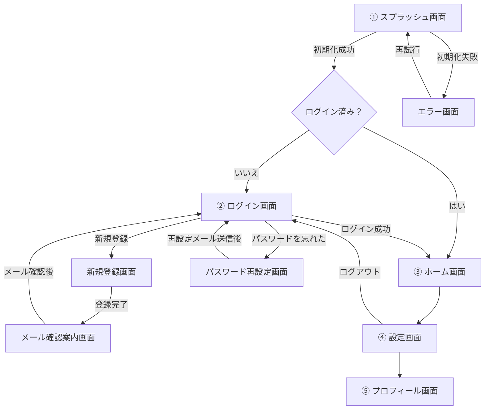
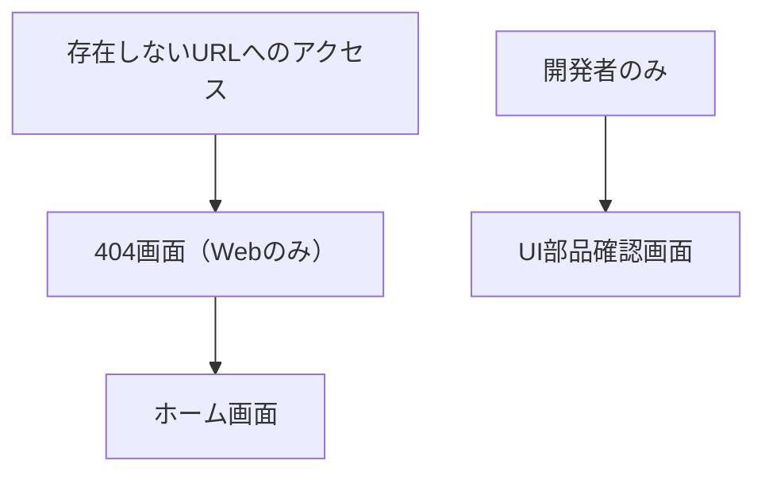

# 外部設計・UI

利用者から見える画面、操作、表示ルールを記録します。

## 画面一覧

### 通常画面

| 区分 | 画面 | 役割 |
| --- | --- | --- |
| 起動 | スプラッシュ画面 | アプリの初期化と認証状態の確認 |
| 認証前 | ログイン画面 | メールアドレスとパスワードによるログイン |
| 認証前 | 新規登録画面 | アカウントの新規登録 |
| 認証前 | メール確認案内画面 | 確認メールの案内と再送 |
| 認証前 | パスワード再設定画面 | パスワード再設定メールの送信 |
| 認証後 | ホーム画面 | ログイン後の起点 |
| 認証後 | 設定画面 | アプリとアカウントの設定 |
| 認証後 | プロフィール画面 | プロフィールの確認と編集 |
| システム | エラー画面 | 初期化失敗など、継続できないエラーの表示 |
| Web | 404画面 | 存在しないURLへアクセスした場合の案内 |
| 開発専用 | UI部品確認画面 | 共通UI部品と各状態の確認 |

## 画面遷移

通常利用の流れは上から下へ記載し、通常フローに含まれない画面は補助画面として分離します。

### 通常フロー

### 補助画面

## スプラッシュ画面

- アプリ起動中に表示する
- アプリのロゴと名前を中央に表示する
- 認証状態と初期データを確認する
- 読み込み完了後、ログイン済みならホーム画面へ遷移する
- 未ログインならログイン画面へ遷移する
- 初期化に失敗した場合はエラー画面へ遷移する
- 最低表示時間は設けず、準備ができ次第遷移する

## メール確認案内画面

- 確認メールを送信したメールアドレスを表示する
- メール内のリンクを開くよう案内する
- 確認メールの再送ボタンを表示する
- ログイン画面へ戻るリンクを表示する
- 再送中は二重送信を防止する
- 再送の成功・失敗はSnackbarで表示する

## 今後記録する内容

- 各画面の表示項目
- 入力・操作仕様
- 認証後の画面構造
- レスポンシブ対応
- ローディング・空状態・エラー表示
- Snackbar・ダイアログなどの共通表示
- アクセシビリティ
- 未決事項
